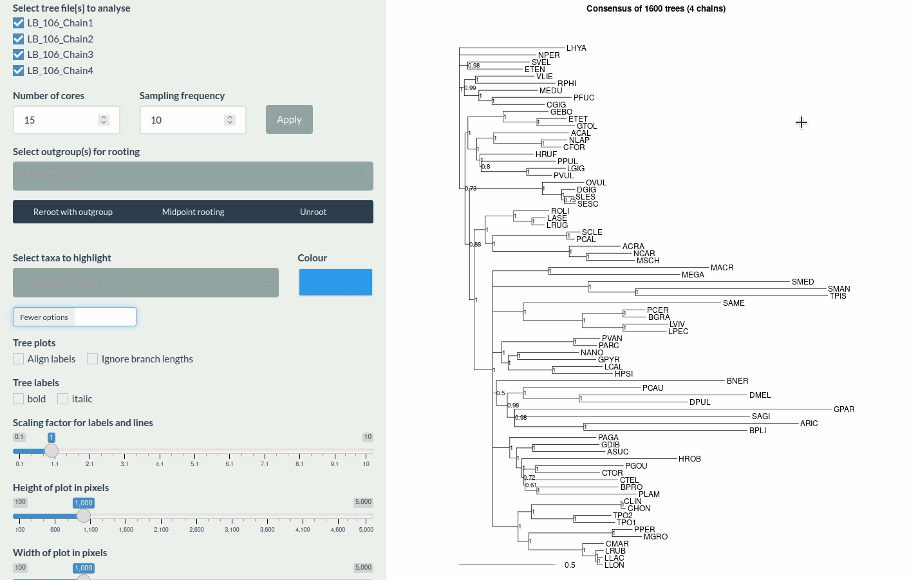
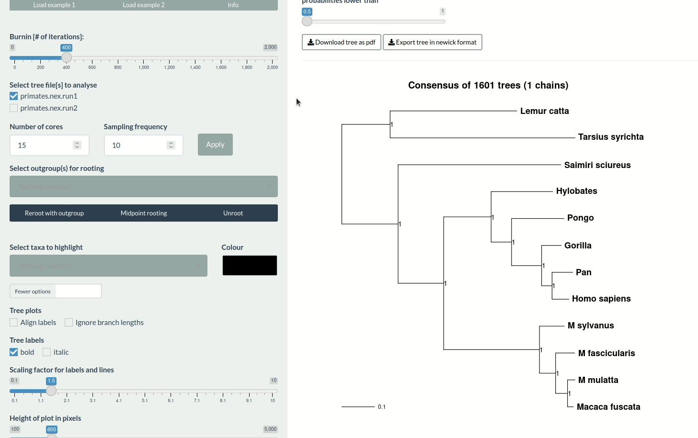

This tutorial will guide you through *postpb* usage by explaining each of the panels in the app and their main functions.

# Orientation

After installing and starting *postpb* as described [here](https://github.com/gerthmicha/postpb#installation), make sure the app runs in your browser using full screen. If you are using Rstudio, it may display the app in its viewer. In that case, you can switch to the browser by clicking 'open in browser' in the viewer's top panel.

Similar to a regular website, *postpb* is organised in multiple pages (panels) which which can be accessed by clicking on the tabs on the very top the the screen ('Parameters', 'Trees', 'About'). While the latter contains some general information, the former 2 are where the analyses happen. Note that the panels are completely independent of each other, meaning that you can use one or both, and that you don't necessarily need to provide data from the same runs to both panels (although this is the typical use case).

# File formats

When you start the app, you will likely have data from a Bayesian phylogenetic analysis. Typically, this would be

1)  Parameter or trace files that contain the values of various estimated model parameters over the length of the run, and
2)  Tree files containing estimated phylogenies for each iteration of the run.

Depending on the software used, these files may look quite differently. *postpb* works best with output files from *Phylobayes* and *MrBayes*, but should work for other Bayesian phylogenetics software as well.

-   Parameter files are typically tabulator separated files, with one column per model parameter, and one line for each iteration or generation of the run. Files produced by *Phylobayes* and *MrBayes* end in `.trace` or `.p`, respectively.
-   Tree files contain one tree per iteration of the run. The most typical tree formats are Newick (e.g., used by Phylobayes, files end in `*.treelist`) and Nexus (used by MrBayes, `*.t` file ending).

Examples of these file types can be found in [the example folder](https://github.com/gerthmicha/postpb/tree/master/example) of this repository.

# Examples

The examples were specifically chosen to illustrate a 'good' Phylobayes run (good mixing of chains, convergence between and within chains achieved, no topological conflict, **Example 2**) and a run that was not successful (**Example 1**). To familiarise yourself with the app, please have a look at the examples first.

# The Parameters tab

When you start the app, the 'Parameters' tab will open automatically. You will notice that there is a side panel to the left, and a main display area to the right. The main display carries 4 tabs ('Traces', 'Violin', 'Density', 'Summary statistics'). The side panel is where you find all of the global options and settings, i.e., the settings that apply to each of the plots.

To get to know the app, it makes sense to use one of the examples. Click 'Load example 1' and wait for a plot to appear. Alternatively, upload your own data through the interface.

## Sidebar

In the sidebar to the left, the following global options (i.e., applying to all trace plots) are available:

-   **Burnin** - the number of iterations to exclude from the beginning of the run. This defaults to 20% of the shortest chain, but it makes sense to play around with this (indeed, one of the aims of *postpb* is to allow you to choose a sensible burnin size). Changing this will automatically update the plots and stats in the main panel.
-   **Select trace file** - it is recommended to have multiple runs and/or chains for your Bayesian phylogenetics analysis. Here, you can exclude selected chains from your *postpb* analysis. This may be sensible if one of your chains is a clear outlier. Any alterations will automatically update your plots and stats in the main panel.
-   **Sampling frequency** - How many data points from your Bayesian phylogeny do you want to analyse in *postpb*? The default value is 10, meaning only 10% of the run will be analysed. Due to the high autocorrelation in Bayesian phylogenetics analyses, this is often a good default. Keep in mind however that you may already have specified a reduced sampling frequency within e.g., *Phylobayes* or *Mr Bayes*. If you want to include the entire run, choose '1'. Low values here will result in longer run times of *postpb*. To change the sampling frequency and update your plots and stats in the main panel, click 'Apply'
-   **More options** - this button enables another suit of options that are all about the layout of the plots (size and number of columns). All changes will be applied immediately.
-   **Download pdf** - press this once happy with the look of your plots. A pdf will be generated for you to download.

**IMPORTANT:** The items in the main panel area will update dynamically if any of the global options are changed, and each change will take a moment to be applied. It is therefore recommended not to make too many changes at once.

## Main panel

Access the parameter plots by clicking through the different panels of the main display. Alter the global options (e.g., burnin and sampling frequency) to see how that affects descriptive plots and statistics.

-   **Trace** - generates simple scatter plots of all variables over iteration of the analysis. This is a very common way of displaying results of a Bayesian analysis and is helpful in determining suitable burnin sizes and in assessing chain convergence and mixing. You can choose to have the scatter plots in lines, points, or both. Play around with the burnin slider and observe how the plot changes. Ideally, a trace plot should look like a 'fat caterpillar' (have a look at **Example 2**) - this indicates good mixing, i.e., the chain is exploring the parameter space well (successive steps don't stay on the same value for very long and don't follow only a single direction).

-   **Violin** & **Density** - these very similar plots show the distribution of your parameters in the post-burnin sample. The plots are especially helpful in determining how similar the different chains are compared with each other. Ideally, you'd want the shape of these plots to be very similar between independent chains. Large differences in the distributions indicate poor convergence between chains.

-   **Summary statistics** - here, the data is summarised once more using descriptive statistics. Click on the 'Toggle explanations' button to learn a bit about the different values and what they may mean for the interpretation of the run. For documentation purposes, the table of values can be copied to the clipboard (e.g., to paste them into a spreadsheet application), downloaded as `.csv` file or printed from the browser.

# The Trees tab

Access the trees tab through the panel at the very top of the page. Again, using one of the examples is probably a good way of trying out the app. Alternatively, upload your tree files through the interface. Once you uploaded tree data, *postpb* will begin calculating a consensus tree. Depending on the number of your trees, this may take some time. A popup will remind you to be patient here.

Before checking out the tree, familiarise yourself with the global options (panel on the left). Much of this is very similar to the traces tab:

-   **Burnin** & **Select tree files** - do exactly what they do in the traces tab.
-   **Number of cores** - some of the most intense computations benefit from parallelisation. *postpb* will automatically detect the number of cores available on your machine and select one core fewer than the maximum number. Choose a lower value if you run many other processes parallel to *postpb* (but be prepared it may then take longer to run).
-   **More options** - as in the traces tab, you will find some display options here, all of which will be applied immediately. 

## Consensus tree display and customization

After loading an example or results files, a consensus tree will be generated and displayed in the main panel area. The tree can now be modified through various means.

> Any alterations made here will be applied to all subsequent tree plots in the other tabs as well. 

**Rooting |** The consensus tree can be midpoint rooted by clicking 'midpoint rooting'. Alternatively, the outgroup taxa can be selected in the dropdown menu in the sidebar ('Select outgroups for rooting') and clicking 'Reroot with outgroup' after the selecting is complete. Interactive rooting is also supported: Click and drag the mousepointer around outgroup taxa. When releasing the mouse button, confirm in the popup that you wish to use these taxa for rooting and finally, apply the rooting by clicking 'Reroot with outgroup'. See interactive rooting in action below.

```{r Fig. 1, echo=FALSE, fig.align='center', fig.cap="*Interactive rooting in postpb.*", out.width="90%", }

```

**Collapsing poorly supported nodes |** By definition, a consensus cladogram only shows nodes that are found in at least half of all trees of the posterior sample. This means however that the consensus tree might still contain nodes that are poorly supported. The slider at the very top of the main panel can be used to collapse nodes below a user defined value. 

**Highlighting taxa |** Highlighting specific taxa works very similarly to rooting the tree: You can specify which taxa to be highlight using the dropdown menu in the sidebar ('Select taxa to highlight'). Alternatively, you can interactively highlight multiple taxa. 

> When using multiple colours, you need to first select the taxa to highlight, and then the colour to use. This is demonstrated below. 


```{r Fig. 2, echo=FALSE, fig.align='center', fig.cap="*Interactive highlighting in postpb.*", out.width="90%", }

```


